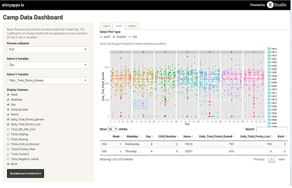
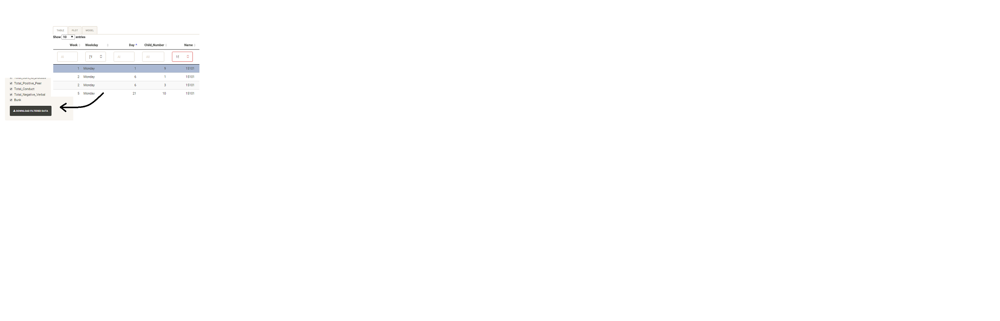
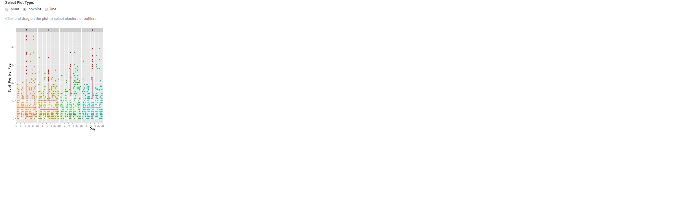
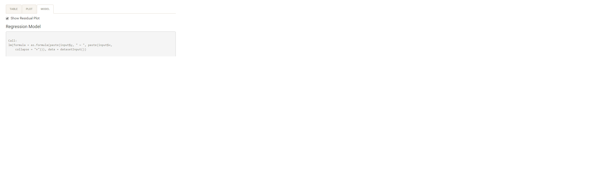

## Problem:

You are a researcher at a major university working with data that tracks the behavior of children at a summer camp.  

Your old, slow Excel spreadsheet with macros makes it difficult for you to quickly identify clusters and outliers.  Worse still, the university doesn't have the resources to overhaul your current setup.  

What if I told you that <b>interactive visualizations</b>, <b>rapid subsetting</b> of variables, and <b>snapshots of linear models</b> could be viewed with the click of a mouse?  What if I told you R was capable of streamlining all of these exploratory data analyses into one simple app accessible via the web?

--- &twocol 

## Solution:  Camp Data Dashboard

Well, that __is__ what I'm telling you!

*** =left

* The essential utility of the Camp Data Dashboard is to efficiently inspect your data and prepare it for further analysis.

* This is achieved through interactive tables, plots, and linear models.

* Future releases will include importing data, plotting a filtered table, and more modeling and plotting customization!

*** =right


--- &twocol

## Data Tables and Export

DataTables are flexible objects that quickly subset and sort the data they are populated with.

*** =left width:33%



*** =right width:66%

With the click of a button, your subsetted data will be saved as a .csv file, with the date-time included in the file name for reference.

To change which columns you want displayed in the DataTable, use the checkboxes in the left panel.  Note: If you try to plot a variable while its box is unchecked, the app won't be able to find the data.

Using DataTables in conjunction with the plotting features makes finding a group of values to feed back into Excel or other software easy!

--- &twocol 

## Interactive Plots

*** =right


*** =left

Ggplot2 visualizations can be brushed by clicking and holding the mouse to select individual or groups of points.

The points you select on the plot will be displayed in a data table below, allowing you to easily identify the camper and look up the rest of their values.

--- &twocol

## Linear Models and Residuals


While the creators of Camp Data Dashboard discourage [p_hacking](https://en.wikipedia.org/wiki/Data_dredging), we have included a feature that allows for the rapid testing of basic linear models.  The output is from the R function `lm`, seen here:  

```{r echo=F}
campdata <- read.csv("dataset1.csv", header = TRUE)
    campdata <- campdata[, -1]
    leave_out <- c( 15101,15103, 15104, 15108, 15111, 15112, 15204,15205, 15209, 15210,  15212,
                    15301, 15307, 15308,15309, 15310, 15403, 15405,15503, 15504,15611,
                    15701, 15707, 15708, 15709, 15712)
```

```{r collapse = T}
sample.model <- lm(Total_Positive_Peer ~ Day, data = campdata)
sample.model$coefficients
```

In addition, the 'Model' tab includes the option to view a residual plot of your Y variable, and a summary of each of the variables you selected to be displayed in the DataTable.




